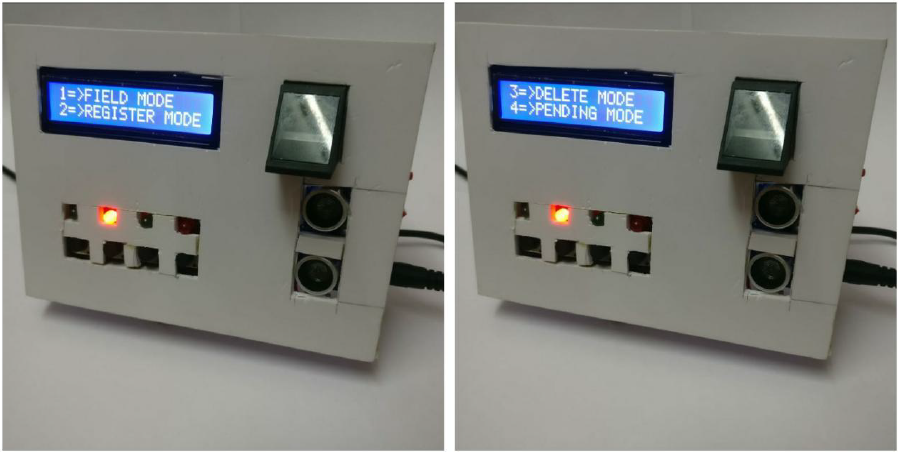

## Fingerprint-Based Student Attendance System

### Description: 
This project focuses on the development of a student attendance management system utilizing fingerprint recognition technology. The aim is to efficiently manage student attendance while preventing proxy attendance and encouraging regular class attendance. Fingerprint recognition is chosen for its speed, security, and uniqueness, making it a reliable biometric identification method.

### What it does: 
The system maintains a database of enrolled students' fingerprints. During each class, students mark their attendance by placing their fingerprints on a scanner. The system matches the fingerprint with the database and records attendance. It eliminates the need for manual attendance taking, saves time for both students and teachers, reduces paper usage, and provides attendance reports when needed.

### Technologies Used: 
This system employs fingerprint recognition technology for student identification. It operates in two modes:

#### Verification/Enrollment Mode: 
Reference models for all users are generated and stored in the database. Sample fingerprints are matched with reference models to calculate genuine and imposter scores.

#### Identification Mode: 
This mode performs one-to-many comparisons against the biometric database to establish the identity of an unknown individual.

The project showcases the application of biometrics beyond security to automate attendance management, making the process more reliable, convenient, efficient, and accurate.

### Output
*Project Poster*

*UI*

*Fingerprint Module*

